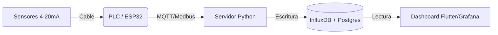

# Diseño de Proyecto: Sistema SCADA Farmacéutico (IoT) 💊🌡️

**Objetivo:** Monitoreo crítico de variables ambientales (Presión, Temperatura, Humedad) en salas limpias, cumpliendo normativas internacionales (FDA).

## 1. Descripción General
Sistema integral de adquisición de datos y supevisión (SCADA) para la industria farmacéutica. Permite visualizar en tiempo real el estado de "Salas Blancas" o almacenes de medicamentos, garantizando la integridad del producto.
*   **Normativa Clave:** Diseñado bajo estándares **21 CFR Part 11** (firmas digitales y audit trail) y **GMP** (Buenas Prácticas de Manufactura).

## 2. Arquitectura de Hardware 🔌

### Nivel 1: Sensores (Campo)
Para farmacéutica, se requieren sensores industriales de alta precisión (4-20mA o Modbus).
*   **Presión Diferencial:** Dwyer Magnehelic o transmisores digitales (para asegurar que el aire sucio no entre a la sala limpia).
*   **Temperatura y Humedad:** Sensores industriales (ej. Vaisala o Honeywell) con salida 4-20mA.

### Nivel 2: Adquisición de Datos (IoT Gateway)
*   **Opción Profesional:** PLC (Siemens S7-1200 o Logo!) recolectando señales analógicas.
*   **Opción "Low-Cost" / Prototipo:** Microcontroladores **ESP32** con convertidores ADC industriales.
    *   *Protocolo:* MQTT (Internet of Things) o Modbus TCP.

## 3. Arquitectura de Software 💻

### Backend (El Cerebro)
*   **Lenguaje:** Python 3.10+
*   **Broker Mensajería:** Eclipse Mosquitto (MQTT) para recibir datos de los sensores.
*   **Base de Datos:**
    *   **InfluxDB:** Base de datos de series temporales (TSDB). Perfecta para guardar 1 dato cada segundo por años.
    *   **PostgreSQL:** Para guardar usuarios, alarmas y logs de auditoría (Audit Trail).

### Frontend (SCADA / HMI)
*   **Panel Web/Escritorio:** Grafana (para gráficos históricos) o una App Flutter Desktop personalizada.
*   **App Móvil (Flutter):** Dashboard para gerentes de planta.
    *   *Alertas:* Notificaciones Push si la temperatura sube de 25°C ("Excursión Térmica").

## 4. Funcionalidades Críticas (Regulatorias)
1.  **Audit Trail Inmutable:** Si alguien cambia un límite de alarma, queda registrado QUIÉN, CUÁNDO y POR QUÉ. No se puede borrar.
2.  **Alarmas en Tiempo Real:** Visuales (Semáforo en pantalla) y Remotas (Email/Telegram).
3.  **Reportes Automáticos:** Generación de PDFs con la gráfica de temperatura de las últimas 24h para firmas de calidad.

## 5. Tecnologías Clave para tu Portafolio
*   **Industriales:** Modbus TCP, 4-20mA loops, PLC.
*   **IT/Software:** Python, MQTT, InfluxDB, Flutter, Docker.

---

### Esquema Resumido

